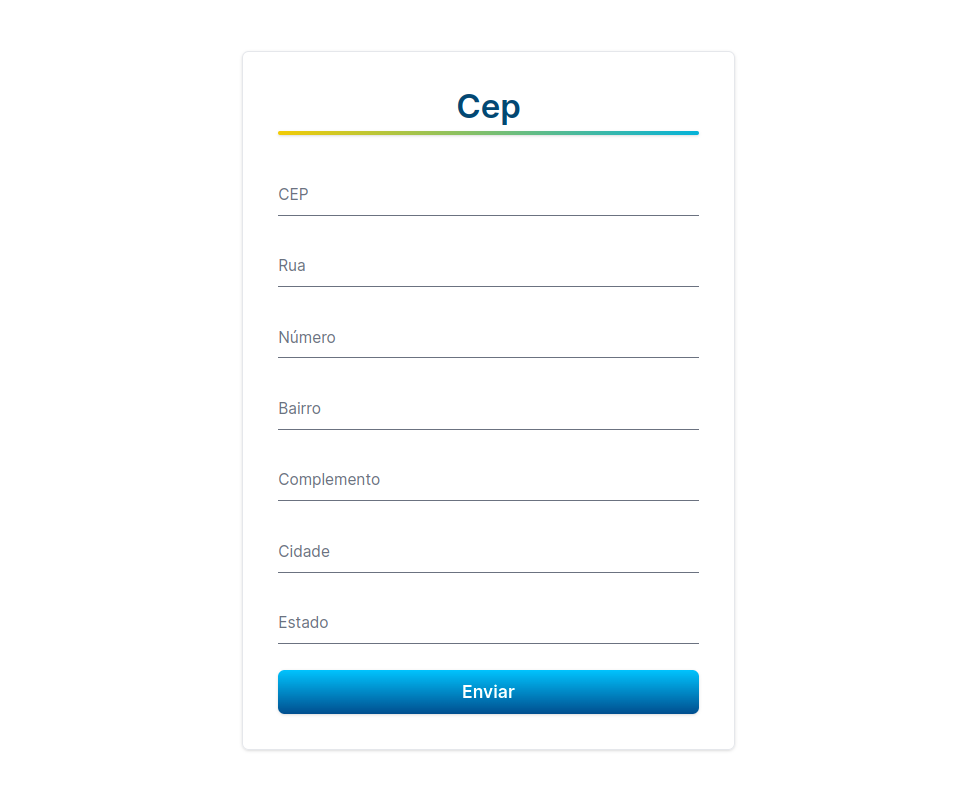

<h1 align="center"> Zipcode </h1>

<p align="center">
Applying principles.
</p>

<p align="center">
  <a href="#-the-project">The project</a>&nbsp;&nbsp;&nbsp;|&nbsp;&nbsp;&nbsp;
  <a href="#-project-goals">Project goals</a>&nbsp;&nbsp;&nbsp;|&nbsp;&nbsp;&nbsp;
  <a href="#-technologies">Technologies</a>&nbsp;&nbsp;&nbsp;|&nbsp;&nbsp;&nbsp;
  <a href="#-deploy">Deploy</a>&nbsp;&nbsp;&nbsp;|&nbsp;&nbsp;&nbsp;
  <a href="#-the-code">The code</a>
</p>

<p align="center">

</p>

<p align="center">
  
</p>

<br>

<p align="center">
  
</p>

<br>

## 💻 The project

The project consisted into build an application that fetches CEP data from an API and shows address information in the main page inputs based on CEP info provided by the user and a button to send information as a registration page.

Users should be able to:

- Fill the form fields and see input masks
- See address information based on brazilian CEP provided info
- See mouse hover and click effects
- Experience the optimal layout depending on their device's screen size

<br>

## 🎯 Project goals

- Test form manipulation with react-hook-form
- Implement form validation with zod
- Integrate both react-hook-form and zod
- Apply DRY and SOLID principles

<br>

## 🚀 Technologies

This project was built using following libraries/frameworks:

- React
- Tailwind
- Vite
- React Hook Form
- Zod
- Axios

<br>

## 🌎 Deploy

Live Site URL: [Zipcode](https://zipcode-mu.vercel.app/)

<br>

## 👨‍💻 The code
### Getting Started with Vite

This project was bootstrapped with [Vite](https://vitejs.dev/).

First, install project dependencies:

```bash
npm install
# or
yarn install
# or
pnpm install
```

After, run the development server:

```bash
npm run dev
# or
yarn dev
# or
pnpm dev
```

Open [http://localhost:5173](http://localhost:5173) with your browser to see the result.


---

#### :memo: License

This project is under a MIT license.
